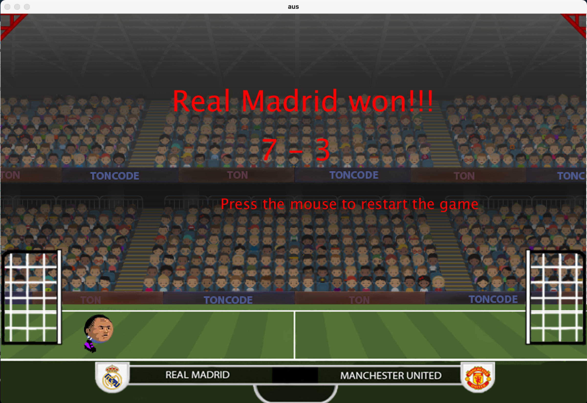
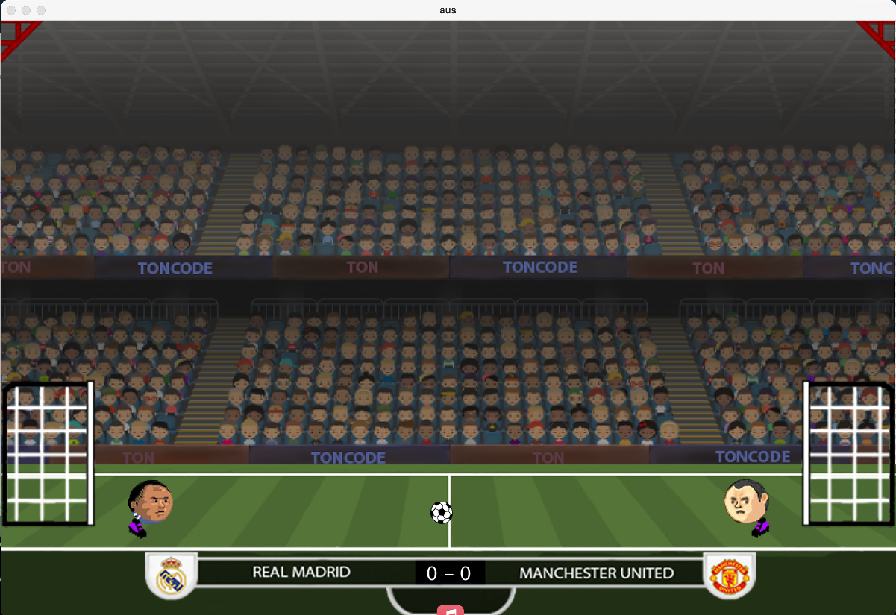

# Head Football Game

Welcome to the Head Football Game! This is a fun and interactive 2D football game where two players compete against each other to score goals using their heads and feet. The game is built using Processing with Python mode and features realistic physics, player animations, and engaging sound effects.

## Game Features
- **2D Football Gameplay**: Control your player to hit the ball, score goals, and win the game.
- **Player Control**: Use intuitive keyboard controls to move, jump, and kick the ball.
- **Realistic Physics**: Enjoy smooth and realistic ball and player interactions.
- **Sound Effects**: Immersive sound effects for kicks, goals, and background music.
- **Game Modes**: Play against a friend on the same keyboard.

## Gameplay Instructions

### Player 1 Controls:
- **Move Left**: Left Arrow (`←`)
- **Move Right**: Right Arrow (`→`)
- **Jump**: Up Arrow (`↑`)
- **Kick**: `P` Key

### Player 2 Controls:
- **Move Left**: `A` Key
- **Move Right**: `D` Key
- **Jump**: `W` Key
- **Kick**: `C` Key

### Game Objective:
- Score 7 goals to win the game.
- The game will display a victory message and the score once a player wins.

### Restart the Game:
- After a player wins, click anywhere on the screen to restart the game.

## How to Run the Game

### Prerequisites
- [Processing](https://processing.org/download/) with [Python Mode](https://py.processing.org/).
- Ensure you have all the images and sound files in the `images` and `sounds` folders, respectively.

### Running the Game
1. Download and install [Processing](https://processing.org/download/).
2. Open the `head_football.pyde` file in Processing.
3. Ensure Python mode is enabled in Processing.
4. Click the "Run" button (or press `Ctrl + R`) to start the game.

## Screenshots

## License
This project is licensed under the MIT License - see the [LICENSE](LICENSE) file for details.

## Contributing
Feel free to fork this repository and make changes. Pull requests are welcome!

## Contact
If you have any questions or suggestions, feel free to reach out via [GitHub Issues](https://github.com/assylbek-saduakhassov-qlub/head_football_game/issues).

---

Enjoy playing the Head Football Game! 🎉
